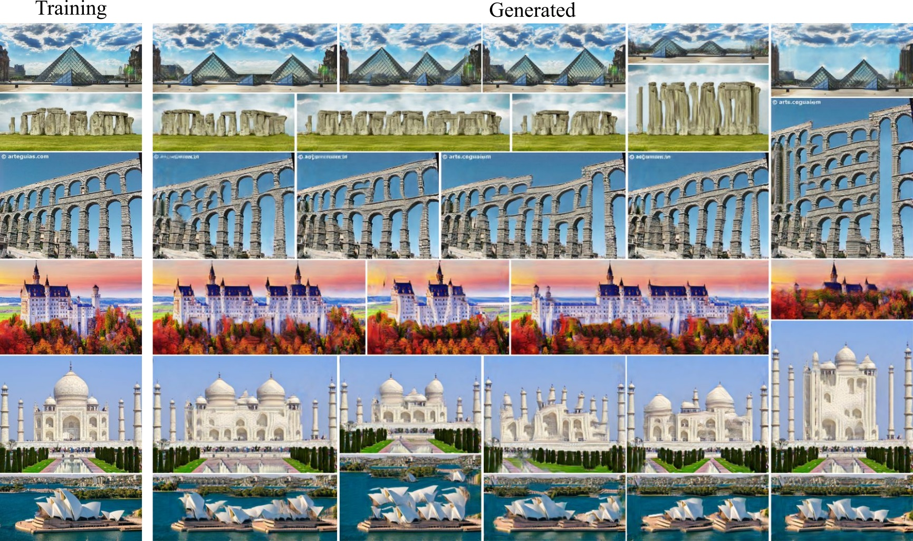
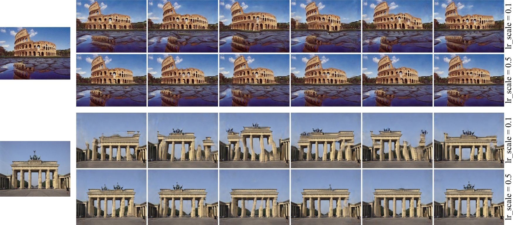
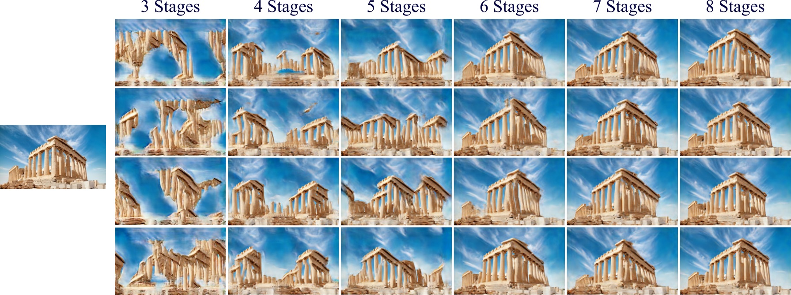
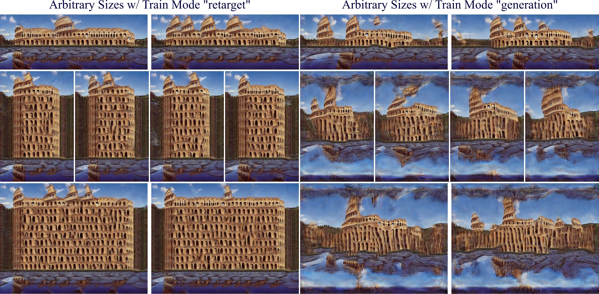
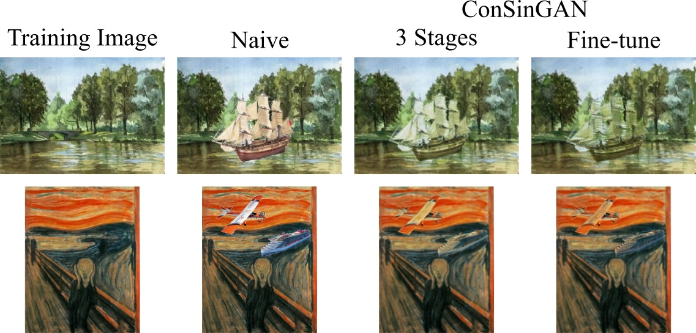
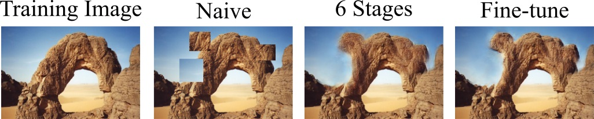

# ConSinGAN

Official implementation of the paper [*Improved Techniques for Training Single-Image GANs"* by Tobias Hinz, Matthew Fisher, Oliver Wang, and Stefan Wermter](https://arxiv.org/abs/2003.11512).

For a short summary of our paper see our [blog post](https://www.tobiashinz.com/2020/03/24/improved-techniques-for-training-single-image-gans.html).

We examine and recomment new techniques for training GANs on a *single* image.
Our model is trained iteratively on several different resolutions of the original training image, where the resolution increases as training proceeds.
Whenever we increase the resolution of the training image we also increase the capacity of the generator by adding additional convolutional layers.
At a given time we do not train the full model, but only *parts* of it, i.e. the most recently added convolutional layers.
The latest convolutional layers are trained with a given learning rate, while previously existing convolutional layers are trained with a smaller learning rate.



# Installation

- python 3.5
- pytorch 1.1.0

```
pip install -r requirements.txt
```

# Unconditional Generation
To train a model with the default parameters from our paper run:

```
python main_train.py --gpu 0 --train_mode generation --input_name Images/Generation/angkorwat.jpg
```

Training one model should take about 20-25 minutes on an NVIDIA GeForce GTX 1080Ti.

### Modify Learning Rate Scaling and Number of Trained Stages
To affect sample diversity and image quality we recomment playing around with the learning rate scaling (default is `0.1`) and the number of trained stages (default is `6`).
This can be especially helpful if the images are more complex (use a higher learning rate scaling) or you want to train on images with higher resolution (use more stages).
For example, increasing the learning rate scaling will mean that lower stages are trained with a higher learning rate and can, therefore, learn a more faithful model of the original image.
For example, observe the difference in generated images of the Colusseum if the model is trained with a learning rate scale of `0.1` or `0.5`:



To modify the learning rate scaling run:

```
python main_train.py --gpu 0 --train_mode generation --input_name Images/Generation/colusseum.jpg --lr_scale 0.5
```

Training on more stages can help with images that exhibit a large global structure that should stay the same, see e.g.:



To modify the number of trained stages run:

```
python main_train.py --gpu 0 --train_mode generation --input_name Images/Generation/colusseum.jpg --train_stages 7
```

### Results
The output is saved to `TrainedModels/` and we log the training process with Tensorboard.
The top left image in the visualized image grids is the original training image, all other images are generated images.
To monitor the progress go to the respective folder and run

```
 tensorboard --logdir .
```

### Sample More Images
To sample more images from a trained model run:

```
python evaluate_model.py --gpu 0 --model_dir TrainedModels/colusseum/.../ --num_samples 50
```

This will use the model to generate `num_samples` images in the default as well as scaled resolutions.
The results will be saved in a folder `Evaluation` in the `model_dir`.

### Unconditional Generation (Arbitrary Sizes)
The default unconditional image generation is geared to also induce diversity at the edges of generated images.
When generating images of arbitrary sizes (especially larger) this often break the image layout.
Therefore, we also provide the option where we change the upsampling and noise addition slightly to improve results when we want to use a model to generate images of arbitrary sizes.
The training, model architecture, loss function, etc stay the same, the only change is the addition of the random noise and a slightly different upsampling routine between the different generator stages.
To train a model more suited for image generation of arbitrary sizes run:

```
python main_train.py --gpu 0 --train_mode retarget --input_name Images/Generation/colusseum.jpg
```



# Harmonization
To train a default harmonization model that does not use anything besides the training image:

```
python main_train.py --gpu 0 --train_mode harmonization --train_stages 3 --min_size 120 --lrelu_alpha 0.3 --niter 1000 --batch_norm --input_name Images/Harmonization/scream.jpg
```

Training should take about 5-10 minutes for three stages. Reducing `--min_size` will speed up the training, increasing it may lead to better results.

To harmonize a given image with a pre-trained model:

```
python evaluate_model.py --gpu 0 --model_dir TrainedModels/scream/.../ --naive_img Images/Harmonization/scream_naive.jpg
```

If you already have a naive image that you want to use to monitor the progress (naive image only used at test time, not at train time):

```
python main_train.py --gpu 0 --train_mode harmonization --train_stages 3 --min_size 120 --lrelu_alpha 0.3 --niter 1000 --batch_norm --input_name Images/Harmonization/pencil_tree.jpg --naive_img Images/Harmonization/pencil_tree_naive.jpg
```

To fine-tune a pre-trained model on a given image (naive image also used at train time):

```
python main_train.py --gpu 0 --train_mode harmonization --input_name Images/Harmonization/pencil_tree.jpg --naive_img Images/Harmonization/pencil_tree_naive.jpg --fine_tune --model_dir TrainedModels/pencil_tree/...
```

Training a model for fine-tuning should take 1-5 minutes, depending on the model and image size.



# Editing
Training for the editing task is the same as for the harmonization task, except that we do it on more stages and with a slightly different image augmentation technique where we swap random patches within the training image at each iteration.

```
python main_train.py --gpu 0 --train_mode editing --batch_norm --niter 1000 --input_name Images/Editing/stone.png

```

or, if an naive image should be used for monitoring training progress (but not for training itself):

```
python main_train.py --gpu 0 --train_mode editing --batch_norm --niter 1000 --input_name Images/Editing/stone.png --naive_img Images/Editing/stone_edit_1.png
```

To fine-tune a model:

```
python main_train.py --gpu 0 --input_name Images/Editing/stone.png --naive_img Images/Editing/stone_edit_1.png --fine_tune --model_dir TrainedModels/stone/...
```

To evaluate:

```
python evaluate_model.py --gpu 0 --model_dir TrainedModels/stone/.../ --naive_img Images/Harmonization/stone_edit_1.png
```



# Additional Data
The folder `User-Studies` contains the raw images we used to conduct our user study.

# Acknowledgements
Our implementation is based on this [implementation](https://github.com/tamarott/SinGAN) of the [SinGAN paper](https://arxiv.org/abs/1905.01164).

# Citation
If you found this code useful please consider citing:

```
@article{hinz2020improved,
  title={Improved Techniques for Training Single-Image GANs},
  author={Tobias Hinz, Matthew Fisher, Oliver Wang, and Stefan Wermter},
  journal={arXiv preprint arXiv:2003.11512},
  year={2020}
}
```

